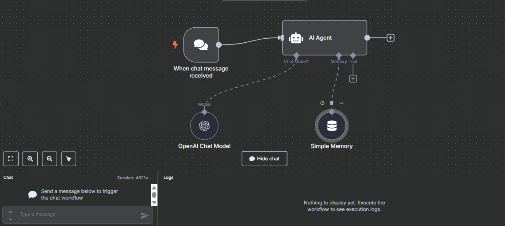

# 🤖 AI Chat Agent (n8n + OpenAI)

The **AI Chat Agent** is a lightweight conversational automation built in **n8n** using the **OpenAI Chat Model** and **Simple Memory**. It listens to incoming messages, understands the intent, and maintains conversation context for natural replies.

---

**🧠 AGENT FUNCTIONALITY**

- Listens for chat messages via a trigger
- Uses **OpenAI GPT-4 or GPT-3.5** to generate replies
- Maintains context across turns using **Simple Memory**
- Can be easily extended with more tools (e.g., Notion, Gmail, APIs)

---

**🖼️ AGENT WORKFLOW PREVIEW**

---

**🔧 SETUP INSTRUCTIONS**

1. **Import the Workflow**  
   In n8n, click `Import` and upload `ai-chat-agent-workflow.json`.

2. **Connect Your Accounts**
   - **OpenAI** (via API key in the Chat Model node)

3. **Customize the Agent**
   - Modify the system prompt inside the `AI Agent` node
   - Adjust memory duration or scope as needed
   - Add output tools to perform actions like replying, storing logs, or sending emails

---

**💡 EXAMPLE PROMPTS**

- "What are your capabilities?"
- "Remind me what I said earlier."
- "Summarize this paragraph..."
- "Act as a meeting assistant."

---

**📦 REQUIREMENTS**

- Active **n8n** instance (local or hosted)
- **OpenAI API Key** (for GPT models)

---

**📩 CONTRIBUTE OR EXTEND**

Fork this and build your own:

- Slack/Telegram chat agents  
- AI scheduling assistants  
- FAQ responders  
- Personal journaling bots  
